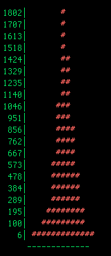
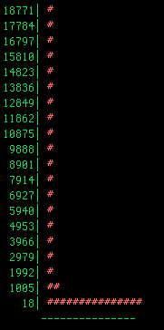
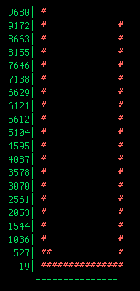

# Oyster River Strand Exam Tool

The Oyster River Strand Exam Tool is adapted from the [Trinity Strand Examination script](https://github.com/trinityrnaseq/trinityrnaseq/wiki/Examine-Strand-Specificity). It runs automatically as the `strandeval` step of both `oyster.py` and `chowder.py`, once the final `<run>.ORP.fasta` is written; there is nothing to run by hand.

It samples 400,000 read pairs from the corrected reads (`seqtk sample`, fixed seed), maps them to the assembly with `bwa mem`, and for each transcript counts which strand the first read of each properly-paired pair lands on (`scripts/examine_strand.pl`). It then plots (plus_strand - minus_strand) / total across transcripts as a text histogram, which helps us understand the strandedness of the assembly, and if we assembled correctly. The histogram is printed at the end of the run and saved in `reports/<run>.strandeval_summary.txt` and `reports/qualreport.<run>`. Here are the 3 major types of plots you could receive back.

## Assembled Correctly

This plot, showing a somewhat normal distribution, is an example of a *non-strand-specific* library, assembled properly.

This plot, showing an extremely biased (can be either left or right side) unimodal distribution, is an example of a *strand-specific* library, assembled properly. It should be noted that as a result of imperfect library generation (wet-lab issue), there may be a second, smaller peak on the opposite side of the histogram. Basically, the quality of strand-specific libraries varies, and this may introduce noise in this analysis.

## Assembled Improperly

This plot, showing an extremely biased bimodal distribution, is an example of a *strand-specific* library, assembled in a non-strand-specific fashion.

