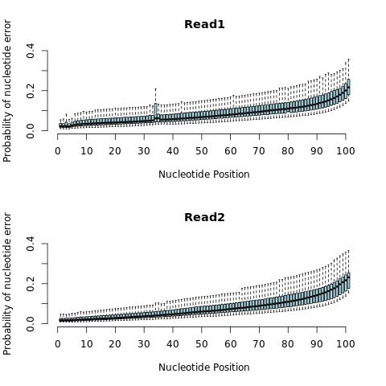

==============================================
Oyster River Protocol For Transcriptome Assembly
==============================================

    The OR Protocol for transcriptome assembly is an actively developed, evidenced based method for optimizing transcriptome assembly. 

--------------------------------------------------
Contact Information
--------------------------------------------------

    - Gitter (preferred) |ImageLink|_
    - Email (good): Matthew.MacManes@unh.edu
    - Twitter (good):  `@macmanes <http://twitter.com/macmanes>`_
    - Phone (discouraged): 603-862-4052
    - Office (I'm hiding under my desk): 189 Rudman Hall

Some method you'd like me to benchmark, file an `issue <https://github.com/macmanes-lab/Oyster_River_Protocol/issues>`_

.. |ImageLink| image:: https://badges.gitter.im/macmanes-lab/Oyster_River_Protocol.svg
.. _ImageLink: https://gitter.im/macmanes-lab/Oyster_River_Protocol

--------------------------------------------------
 :doc:`aws_setup`
--------------------------------------------------

0. Archive Reads.  
-----------------------------------
It is likely a good idea to compress your raw reads and save them elsewhere - like another computer. Computers fail, drives corrupt. Better to NOT lose your data in the process.

1. Initial Quality Check
-----------------------------------

::

  SolexaQA++ analysis file_1.fastq file_2.fastq
  
Plot Results using R

::

  R #this opens R on your AWS machine
  
  qual1 <- read.delim("file_1.fastq.quality")
  qual2 <- read.delim("file_2.fastq.quality")
  jpeg('qualplot.jpg')
  par(mfrow=c(2,1))
  boxplot(t(qual1), col='light blue', ylim=c(0,.4), frame.plot=F, outline=F, xaxt = "n", ylab='Probability of nucleotide error', xlab='Nucleotide Position', main='Read1')
  axis(1, at=c(0,10,20,30,40,50,60,70,80,90,100), labels=c(0,10,20,30,40,50,60,70,80,90,100))
  boxplot(t(qual2), col='light blue', ylim=c(0,.4), frame.plot=F, outline=F, xaxt = "n", ylab='Probability of nucleotide error', xlab='Nucleotide Position', main='Read2')
  axis(1, at=c(0,10,20,30,40,50,60,70,80,90,100), labels=c(0,10,20,30,40,50,60,70,80,90,100))
  dev.off()
  quit()
  n

2. Error Correct
-----------------------------------

Use RCorrector if you have *more* than 20 million paired-end reads

::

  perl run_rcorrector.pl -k 31 -t 30 \
  -1 file_1.fastq \
  -2 file_2.fastq

Use bfc if you have *less* than 20 million paired-end reads. If you are using Illumia fastQ format 1.8 or later, read bfc_pairing

::

  seqtk mergepe file_1.fastq file_2.fastq > inter.fq
  bfc -s 50m -k31 -t 16 inter.fq > bfc.corr.fq
  split-paired-reads.py bfc.corr.fq
  mv bfc.corr.fq.1 bfc.corr.1.fq
  mv bfc.corr.fq.2 bfc.corr.2.fq

3. Aggressive adapter & gentle quality trimming. 
-----------------------------------
One should aggressively hunt down adapter seqeunces and get rid of them. In contrast, gently trim low quality nucleotides. Any more will cause a significant decrease on asembly completeness, as per http://journal.frontiersin.org/article/10.3389/fgene.2014.00013/. I typically do both these steps from within Trinity (using Trimmomatic), but one could do trimming as an independent process if desired. 

4. Assemble
-----------------------------------
Assemble your reads using Trinity. If you have stranded data, make sure to iclude the ``--SS_lib_type RF`` tag, assuming that is the right orientation (If you're using the standard TruSeq kit, it probably is). Also, you may need to adjust the ``--CPU`` and ``--max_memory`` settings. Change the name of the input reads to match your read names. 

::

  Trinity --seqType fq --max_memory 40G --trimmomatic --CPU 30 --full_cleanup --output Rcorr_trinity \
  --left file_1.cor.fastq \
  --right file_2.cor.fastq \
  --quality_trimming_params "ILLUMINACLIP:/home/ubuntu/trinityrnaseq/trinity-plugins/Trimmomatic/adapters/TruSeq3-PE-2.fa:2:40:15 LEADING:2 TRAILING:2 MINLEN:25"

5. Quality Check
-----------------------------------
If you have followed the ORP AWS setup protocol, you will have the BUSCO Metazoa and Vertebrata datasets. If you need something else, you can download from here: http://busco.ezlab.org/. You should check your assembly using BUSCO. For most transcriptomes, something like 60-90% complete BUSCOs should be accepted. This might be less (even though your transcriptome is complete) if you are assembling a marine invert or some other 'weird' organism. 

::

  python3 ~/BUSCO_v1.1b1/BUSCO_v1.1b1.py -m Trans --cpu 16 -l ~/BUSCO_v1.1b1/vertebrata \
  -o assemb_name -g Rcorr_trinity.Trinity.fasta 

You should evaluate your assembly with Transrate, in addition to BUSCO. A Transrate score > .22 is generally thought to be acceptable, though higher scores are usually achievable. There is a ``good*fasta`` assembly in the output directory which you may want to use as the final assembly, for further filtering [e.g., TPM], or for something else. 

::

  transrate -o assemb_name -t 16 \
  -a Rcorr_trinity.Trinity.fasta \
  --left file_1.cor.fastq \
  --right file_2.cor.fastq

6. Filter
-----------------------------------

Filtering is the process through which you aim to maximize the Transrate score, which assays structural integrity, while preserving the BUSCO score, which assays genic completeness. At some level this is a trade off. Some people may require a structually accurate assembly and not care so much abot completeness. Others, dare I say most, are interested in completeness - reconstructing everything possible - and care less about structure. 

In general, for low coverage datasets (less than 20 million reads), filtering based on expression, using TMP=1 as a threshold performs well, with Transrate filtering often being too aggressive. With higher coverage data (more than 60 million reads) Transrate filtering may be worthwhile, as may expression filtering using a threshold of TMP=0.5. Again, these are general recommendations, you're dataset may perform differently.

To do the filtering, run BUSCO on the ``good*fasta`` file which is a product of Transrate. This assembly may be very good (or maybe not). I typically use this one if the number of BUSCOs does not decrease by more than a few percent, relative to the raw assembly output from Trinity. Use the BUSCO code from above, changing the name of the input and output. In addition to Transrate filtering (of as an alternative), it is often good to filter by gene expression. I typically filter out contigs whose expression is less than TMP=1 or TMP=0.5.

Estimate expression with Kallisto

::

  kallisto index -i kallisto.idx Rcorr_trinity.Trinity.fasta
  kallisto quant -t 32 -i kallisto.idx -o kallisto_orig -b 100 file_1.cor.fastq file_2.cor.fastq
  
Estimate expression with Salmon

::

  ~/salmon-0.5.1/bin/salmon index -t Rcorr_trinity.Trinity.fasta -i salmon.idx --type quasi -k 31
  ~/salmon-0.5.1/bin/salmon quant -p 32 -i transcripts2_index -l MSR -1 file_1.cor.fastq -2 file_2.cor.fastq -o salmon_orig

Pull down transcripts whose TPM > 1. 

::

  awk '1>$5{next}1' kallisto_orig/abundance.tsv | awk '{print $1}' > kallist
  awk '1>$3{next}1' salmon_orig/quant.sf | sed  '1,10d' | awk '{print $1}' > salist
  cat kallist salist | sort -u > uniq_list
  sed -i ':begin;N;/[ACTGNn-]\n[ACTGNn-]/s/\n//;tbegin;P;D' Rcorr_trinity.Trinity.fasta

  for i in $(cat uniq_list); 
     do grep --no-group-separator --max-count=1 -A1 -w $i Rcorr_trinity.Trinity.fasta >> Rcorr_highexp.trinity.Trinity.fasta; 
  done

7. Annotate  
-----------------------------------
I have taken a liking to using dammit! (http://dammit.readthedocs.org/en/latest/). 

::

  mkdir /mnt/dammit/ && cd /mnt/dammit
  dammit databases --install --database-dir /mnt/dammit --full --busco-group metazoa
  dammit annotate assembly.fasta --busco-group metazoa --n_threads 36 --database-dir /mnt/dammit/

8. Report
-----------------------------------
Verify the quality of your assembly using content based metrics. Report Transrate score, BUSCO statistics, number of unique transcripts, etc. Do not report meaningless statistics such as N50
